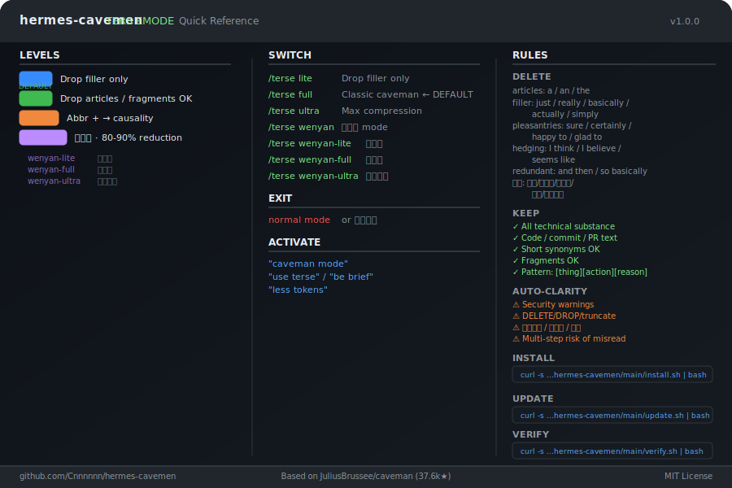

# hermes-cavemen

[English](#english) | [中文](#中文)

---

## ⚡ Quick Start

**One sentence to your AI — fully automatic:**

> "Apply hermes-cavemen terse mode to me"

Your AI will detect the platform, download rules, update `SOUL.md` and `MEMORY.md`, all in one shot.

**Or one line in terminal:**

```bash
curl -s https://raw.githubusercontent.com/Cnnnnnn/hermes-cavemen/main/install.sh | bash
```

That's it. Terse Mode (`full`) activates on every new session. No restart needed.

**Verify:**
```
/sklls_list | grep terse
```
Should show `terse — hermes-cavemen` in the list.

**Switch levels:**
```
/terse ultra           # max compression
/terse wenyan          # 文言文
/terse wenyan-lite     # 半文言
/normal mode           # exit
```

---

# English

## What is this

A Hermes Agent / OpenClaw adaptation of [JuliusBrussee/caveman](https://github.com/JuliusBrussee/caveman). Reduces output tokens ~75% while preserving full technical accuracy.

**Terse Mode is ON by default.** No plugin install needed — just copy rules into `SOUL.md`.

## Before / After


| Normal (87 tokens) | Terse — full (24 tokens) |
|--------------------|-------------------------|
| "当然！我很高兴帮你解决这个问题。你遇到的问题很可能是由于认证中间件没有正确验证 token 过期时间导致的。让我看一下并建议一个修复方案。" | "认证中间件 bug。Token 过期检查用了 < 而不是 <=。修：" |

Same fix. 75% less words. Brain still big.

## Installation

### Option A — Merge (recommended)

Copy the `## Terse Mode` section from [`SOUL.md`](SOUL.md) and append it to your existing `SOUL.md`. Your existing content stays intact.

### Option B — Replace

Replace your `SOUL.md` entirely with [`SOUL.md`](SOUL.md) from this repo.

> ⚠️ This overwrites all existing content. Back up first.

## Intensity Levels

| Level | Style | Example |
|-------|-------|---------|
| `lite` | Drop filler/hedging only. Full sentences, articles kept. | "Your component re-renders because you create a new object reference each render. Wrap in useMemo." |
| `full` | Classic caveman. Fragments OK, articles dropped. **← Default** | "New object ref each render. Inline object prop = new ref = re-render. useMemo." |
| `ultra` | Max compression. Abbreviations + `→` for causality. | "Inline obj prop → new ref → re-render. `useMemo`." |
| `wenyan` | 文言文. Classical Chinese terseness. | "物出新參照，致重繪。useMemo Wrap之。" |
| `wenyan-lite` | 半文言. | "組件頻重繪，以每繪新生對象參照故。以 useMemo 包之。" |
| `wenyan-full` | 纯文言. | "物出新參照，致重繪。useMemo ·Wrap之。" |
| `wenyan-ultra` | 极简文言. | "新參照→重繪。useMemo Wrap。" |

**Switch:** `/terse lite|full|ultra|wenyan|wenyan-lite|wenyan-full|wenyan-ultra`
**Exit:** `normal mode` / `正常模式`

## Auto-Clarity

Terse pauses automatically for:

- Security warnings and irreversible action confirmations
- Destructive operations (DELETE / DROP / truncate)
- User asks for detail: `解释一下` / `详细点` / `展开`
- Multi-step sequences where fragment order risks misread

Resumes after the clear part is done.

## Code Boundaries

Code, commit messages, PR descriptions, and technical terms are written normally — terse does not affect them. Inline code comments (inside \`\`\` blocks) are also preserved verbatim. Terseness applies only to natural language output text.

## Level Persistence

Each `/terse xxx` command writes the preference to `MEMORY.md`. On every new session, hermes reads `MEMORY.md` for `terse_level` and applies it automatically. No need to re-set after restart.

## Implementation: Original vs hermes

| Dimension | Original caveman | hermes-cavemen |
|-----------|-----------------|-----------------|
| Target platform | Claude Code | Hermes / OpenClaw |
| Activation | Hook system + flag file | SOUL.md rules injection |
| Persistence | `~/.claude/.caveman-active` flag file | `MEMORY.md` |
| Multi-platform sync | CI auto-syncs to 8+ platforms | Single platform, no sync needed |
| Statusline badge | `[CAVEMAN]` in Claude Code UI | Not available |
| Wenyan sub-levels | lite / full / ultra | lite / full / ultra + wenyan-lite/full/ultra |

**Why the differences?** Hermes / OpenClaw does not expose Claude Code's Hook API, flag file mechanism, statusline, or plugin system. hermes-cavemen achieves equivalent behavior through SOUL.md rules injection, which Hermes reads on every session start.

**What is identical:** Core compression rules, intensity levels, auto-clarity conditions, code/commit/PR boundaries, activation/deactivation commands, ~75% token reduction.

## Maintenance

Three supporting scripts for long-term use:

```bash
# Self-Update — check for new version, show changelog, upgrade in one shot
curl -s https://raw.githubusercontent.com/Cnnnnnn/hermes-cavemen/main/update.sh | bash

# Verify — test if Terse Mode is active, measure compression rate
curl -s https://raw.githubusercontent.com/Cnnnnnn/hermes-cavemen/main/verify.sh | bash

# Uninstall — remove Terse Mode rules, restore backup
curl -s https://raw.githubusercontent.com/Cnnnnnn/hermes-cavemen/main/uninstall.sh | bash
```

See [`TROUBLESHOOTING.md`](TROUBLESHOOTING.md) if anything breaks.

## Project Structure

```
hermes-cavemen/
├── README.md              ← Bilingual intro (this file)
├── SOUL.md                ← Complete Terse Mode rules
├── SKILL.md               ← Skill format (optional)
├── install.sh             ← One-line installer
├── update.sh              ← Self-Update script
├── uninstall.sh           ← Uninstall script
├── verify.sh              ← Installation verifier
├── TROUBLESHOOTING.md     ← Common issues + fixes
├── CHANGELOG.md           ← Version history
├── VERSION                ← Current version
├── .github/
│   └── ISSUE_TEMPLATES/   ← Bug / Feature / Verified templates
└── LICENSE                ← MIT
```

Credit: Based on [JuliusBrussee/caveman](https://github.com/JuliusBrussee/caveman) (37.6k stars, MIT License).

## Quick Reference Card

Visual one-page cheatsheet — all levels, commands, rules, and Auto-Clarity in one image:



*Download: [cheatsheet.svg](cheatsheet.svg) · [cheatsheet.png](cheatsheet.png) (high-res)*

---

# 中文

## ⚡ 快速安装

**一行安装：**

```bash
curl -s https://raw.githubusercontent.com/Cnnnnnn/hermes-cavemen/main/install.sh | bash
```

搞定。Terse Mode（`full` 级别）自动激活，无需重启。

**验证安装：**
```
/sklls_list | grep terse
```
输出中有 `terse — hermes-cavemen` 即为成功。

**切换级别：**
```
/terse ultra           # 极致压缩
/terse wenyan          # 文言文
/terse wenyan-lite     # 半文言
/normal mode           # 退出
```

## 是什么

Hermes Agent / OpenClaw 版本的 [caveman](https://github.com/JuliusBrussee/caveman)。压缩输出约 75%，同时保留全部技术准确性。

**Terse Mode 默认开启。** 无需手动激活。

## 安装方式

### 方式 A — 合并到现有 SOUL.md（推荐）

复制 [`SOUL.md`](SOUL.md) 中的 `## Terse Mode` 部分，追加到现有 `SOUL.md` 文件末尾。原有内容保持不变。

### 方式 B — 完全替换

直接用本仓库的 [`SOUL.md`](SOUL.md) 整体替换。

> ⚠️ 会覆盖原有所有内容，请先备份。

## 效果对比


| 普通输出（87 tokens） | Terse — full（24 tokens） |
|---------------------|-------------------------|
| "当然！我很高兴帮你解决这个问题。你遇到的问题很可能是由于认证中间件没有正确验证 token 过期时间导致的。让我看一下并建议一个修复方案。" | "认证中间件 bug。Token 过期检查用了 < 而不是 <=。修：" |

同样答案。减少 75% 字数。脑子还是那个脑子。

## 级别

| 级别 | 风格 | 示例 |
|------|------|------|
| `lite` | 仅删除 filler/hedging，保留冠词和完整句子。 | "Your component re-renders because you create a new object reference each render. Wrap in useMemo." |
| `full` | 经典 caveman 风格，允许碎片化句子。**← 默认** | "New object ref each render. Inline object prop = new ref = re-render. useMemo." |
| `ultra` | 极致压缩。缩写 + `→` 表示因果。 | "Inline obj prop → new ref → re-render. `useMemo`." |
| `wenyan` | 文言文风格。 | "物出新參照，致重繪。useMemo Wrap之。" |
| `wenyan-lite` | 半文言。 | "組件頻重繪，以每繪新生對象參照故。以 useMemo 包之。" |
| `wenyan-full` | 纯文言。 | "物出新參照，致重繪。useMemo ·Wrap之。" |
| `wenyan-ultra` | 极简文言。 | "新參照→重繪。useMemo Wrap。" |

**切换：** `/terse lite|full|ultra|wenyan|wenyan-lite|wenyan-full|wenyan-ultra`
**退出：** `正常模式` / `normal mode`

## 自动退出情况

以下情况 Terse Mode 自动暂停，恢复正常输出：

- 安全警告 / 不可逆操作确认
- 破坏性操作（DELETE / DROP / truncate）
- 用户要求详细解释：`解释一下` / `详细点` / `展开`
- 多步骤指令可能产生误解时

明确部分完成后自动恢复。

## 代码边界

代码、commit 消息、PR 描述、技术术语均正常书写，不受 terse 影响。`\`\`\` 代码块内的注释也保持原样。Terse 只作用于自然语言输出文字。

## 级别持久化

每次执行 `/terse xxx` 时，偏好会写入 `MEMORY.md`。新会话启动时自动读取并应用，无需重复设置。

## 实现机制：原版 vs hermes-cavemen

| 维度 | 原版 caveman | hermes-cavemen |
|------|-------------|-----------------|
| 目标平台 | Claude Code | Hermes / OpenClaw |
| 激活机制 | Hook 系统 + flag 文件 | SOUL.md 规则注入 |
| 持久化 | `~/.claude/.caveman-active` | `MEMORY.md` |
| 多平台同步 | CI 自动同步到 8+ 平台 | 单平台，无需同步 |
| 状态栏显示 | Claude Code UI 中的 `[CAVEMAN]` | 不支持 |
| Wenyan 子级别 | lite / full / ultra | lite / full / ultra + wenyan-lite/full/ultra |

**差异原因：** Hermes / OpenClaw 不提供 Claude Code 的 Hook API、flag 文件机制、状态栏和插件系统。hermes-cavemen 通过 SOUL.md 规则注入实现等效行为——Hermes 每次启动读取 SOUL.md，规则自动生效。

**完全一致的部分：** 核心压缩规则、强度级别、Auto-Clarity 条件、代码/commit/PR 边界、激活/退出指令、约 75% 的 token 压缩率。

## 维护脚本

三个支撑长期使用的脚本：

```bash
# Self-Update — 检查新版本、显示更新日志、一键升级
curl -s https://raw.githubusercontent.com/Cnnnnnn/hermes-cavemen/main/update.sh | bash

# Verify — 测试 Terse Mode 是否生效，测量压缩率
curl -s https://raw.githubusercontent.com/Cnnnnnn/hermes-cavemen/main/verify.sh | bash

# Uninstall — 移除 Terse Mode 规则，恢复备份
curl -s https://raw.githubusercontent.com/Cnnnnnn/hermes-cavemen/main/uninstall.sh | bash
```

遇问题见 [`TROUBLESHOOTING.md`](TROUBLESHOOTING.md)。

## 项目结构

```
hermes-cavemen/
├── README.md              ← 双语介绍（本文件）
├── SOUL.md                ← 完整 Terse Mode 规则
├── SKILL.md               ← Skill 格式（可选）
├── install.sh             ← 一键安装脚本
├── update.sh              ← 自我更新脚本
├── uninstall.sh           ← 卸载脚本
├── verify.sh              ← 安装验证脚本
├── TROUBLESHOOTING.md     ← 常见问题与解决方案
├── CHANGELOG.md           ← 版本历史
├── VERSION                ← 当前版本
├── .github/
│   └── ISSUE_TEMPLATES/   ← Bug / Feature / Verified 模板
└── LICENSE                ← MIT
```

## 速查卡

可视化单页参考——所有级别、命令、规则、Auto-Clarity 一图掌握：


*下载：[cheatsheet.svg](cheatsheet.svg) · [cheatsheet.png](cheatsheet.png)（高清版）*


致谢：基于 [JuliusBrussee/caveman](https://github.com/JuliusBrussee/caveman)（37.6k stars，MIT License）。
